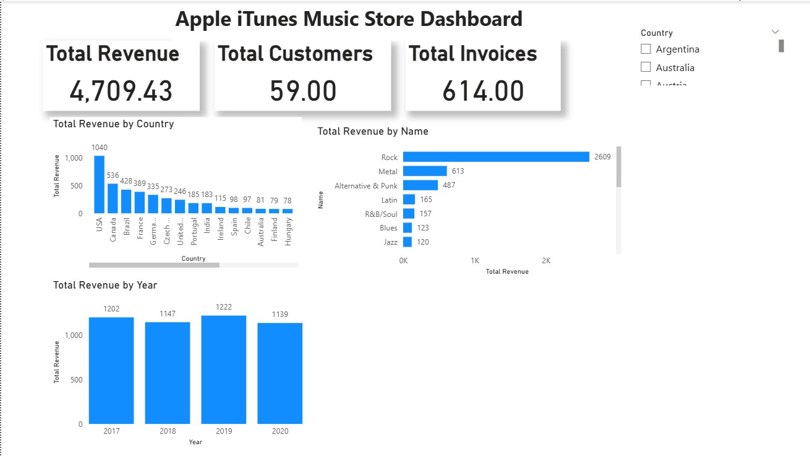

# 🎵 Apple iTunes Music Store Data Analysis

## 📌 Project Overview

This project performs an end-to-end data analysis on the Apple iTunes Music Store dataset using SQL and Power BI.

The goal is to extract business insights from music sales data, understand customer behavior, and build interactive dashboards for decision-making.

---

## 🧰 Tools & Technologies

- SQL (Data Analysis & Querying)
- Power BI (Data Visualization)
- Data Modeling
- Business Intelligence

---

## 📊 Project Structure

- 📁 SQL → Contains all SQL queries used for analysis
- 📁 PowerBI → Interactive dashboard files
- 📁 Documentation → Project reports and analysis documentation
- 📁 Presentation → Final presentation slides

---

## 🔎 Key Analysis Performed

- Top-selling artists and genres
- Revenue analysis
- Customer purchasing behavior
- Sales trends and patterns
- Geographic insights

---

## 📈 Dashboard Insights

The Power BI dashboard provides:

- Revenue overview
- Genre performance
- Customer segmentation
- Sales distribution analysis
- 
### Dashboard Preview

---

---

## 🎥 Project Walkthrough Video

Watch the complete project explanation here:

👉 [Click here to watch the project video](https://drive.google.com/file/d/19zVf-XIDXELFNEcL2m04ukyDfQQK-ShO/view?usp=drive_link)

## 🎯 Business Value

This project demonstrates how raw transactional data can be transformed into actionable business insights using SQL and visualization tools.

---

## 👨‍💻 Author

Data Analyst Portfolio Project by GANGARAPU DATHA NAGA SAI.
